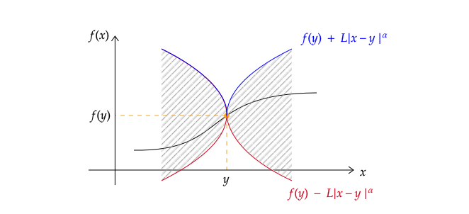
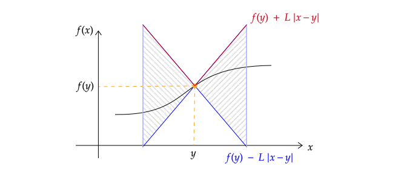

<!-- This is needed since I am working with svg files from mathcha.io. It converts the graphics files to something that can be used in the pdf files. Code taken from https://stackoverflow.com/questions/50165404/how-to-make-a-pdf-using-bookdown-including-svg-images/56044642#56044642 -->

\newpage
\pagenumbering{arabic}

# Introduction {-}
Here is the material to accompany the 10th Analysis 1B Tutorial on the 24th April. Alternative formats can be downloaded by clicking the download icon at the top of the page. Please send any comments or corrections to [Christian Jones (caj50)](mailto:caj50@bath.ac.uk). To return to the homepage, click [here](http://caj50.github.io/tutoring.html).

<!--

Want to ruin the surprise?

 
Well, you asked for it!

-->

# Lecture Recap
This week is all about making our lives easier! Firstly, we're going to see a criterion for determining whether a function is integrable, and then we're going to see that quite a large class of functions are integrable! Finally, we're going to prime ourselves to develop a well-known result --- the fundamental theorem of calculus --- which links differentiation and integration.

## The Cauchy Criterion for Integrability

Recall the definition of the (Riemann) integral:

\BeginKnitrBlock{definition}
<strong>Definition 1.1   (Riemann Integral) </strong>
Let $f:[a,b] \to \mathbb{R}$ be bounded. Then $f$ is *Riemann integrable* if $$\underline{\int_a^b} f = \overline{\int_a^b} f.$$ If this happens, then the (Riemann) integral of $f$ is defined to be the common value, and given the notation $\int_{a}^b f.$

\EndKnitrBlock{definition}

Note that for a function to be integrable, we require both the upper and lower Riemann integrals to exist and be equal. These were defined as follows:

\BeginKnitrBlock{definition}
<strong>Definition 1.2   (Lower and Upper Riemann Integrals) </strong>
Let $f:[a,b] \to \mathbb{R}$ be bounded. Then:
  
  * The *lower Riemann integral* is $$\underline{\int_a^b} f := \sup\left\lbrace L(f,P) \bigg\lvert\; \text{$P$ is a subdivision of $[a.b]$}\right\rbrace.$$
  * The *upper Riemann integral* is $$\overline{\int_a^b} f := \inf\left\lbrace U(f,P) \bigg\lvert\; \text{$P$ is a subdivision of $[a.b]$}\right\rbrace.$$
  

\EndKnitrBlock{definition}

To actually find these values, we need to consider **every** possible subdivision $P$ of the domain $[a.b]$. Doing this practically is near impossible, except in very rare cases[^1]. What we would really like is a way of determining integrability from only a selection of partitions. It shouldn't come as a surprise by now that such a method exists, and it's due to --- you guessed it --- Cauchy![^2]

\BeginKnitrBlock{proposition}
<strong>Proposition 1.1   (Cauchy Criterion for Integrability) </strong>
Let $f:[a,b] \to \mathbb{R}$ be a bounded function. Then $f$ is Riemann integrable if and only if for all $\epsilon > 0$, there exists a subdivision $P$ of $[a,b]$ such that $U(f,P) - L(f,P) < \epsilon.$

\EndKnitrBlock{proposition}

So, why is this formulation useful? Due to Archimedes' principle, we now only have to consider regularly spaced subdivisions $P_n$ of $[a,b]$ to determine integrability! In particular, these subdivisions are given by $$P_n = \lbrace x_0, \ldots, x_n\rbrace, \quad x_i = a + \frac{i(b-a)}{n}.$$ This criterion also gives us the following theorem:

\BeginKnitrBlock{theorem}
<strong>Theorem 1.2  </strong>
Let $f:[a,b] \to \mathbb{R}$. Then

 * If $f$ is monotonic, then it is integrable.
 * If $f$ is continuous, then it is integrable.

\EndKnitrBlock{theorem}
So, using the Cauchy criterion, we have determined that a large class of functions are integrable! However, to prove the second part of this theorem, we require a (slightly) stronger version of continuity.

[^1]: Such as the function $f$ being constant, for example.
[^2]: Result number six on the 'named after Cauchy' counter!

## Uniform Continuity
Recall the definition of (standard) continuity:

\BeginKnitrBlock{definition}
<strong>Definition 1.3   (Continuity) </strong>
Let $D \subseteq \mathbb{R}$, and $f: D \to \mathbb{R}$. Then $f$ is continuous on $D$ if $$\forall c \in D\;\;\forall \epsilon > 0\;\;\exists \delta = \delta(\epsilon,c) > 0\;\;\text{s.t.}\;\;\forall x \in D,\;\; \lvert x - c \rvert < \delta \Rightarrow \lvert f(x) - f(c) \rvert < \epsilon.$$

\EndKnitrBlock{definition}

In this definition, the 'distance' $\delta$ away from $c$ which ensures $f(x)$ remains within a distance $\epsilon$ of $f(c)$ depends on two things: the choice of $\epsilon$, and where you are in the domain $D$, i.e. your choice of $c$. If instead, your choice of $\delta$ remains the same no matter where you are in $D$, then $f$ is said to be **uniformly continuous**. An example of this definition is seen in Figure <a href="#fig:unicont">1.1</a>.[^3]

\BeginKnitrBlock{definition}
<strong>Definition 1.4   (Uniform Continuity) </strong>
Let $D \subseteq \mathbb{R}$, and $f: D \to \mathbb{R}$. Then $f$ is uniformly continuous on $D$ if $$\forall \epsilon > 0\;\;\exists \delta = \delta(\epsilon) > 0\;\;\text{s.t.}\;\;\forall x,y \in D,\;\; \lvert x - y \rvert < \delta \Rightarrow \lvert f(x) - f(y) \rvert < \epsilon.$$

\EndKnitrBlock{definition}

{width=50%}

Furthermore, from Definition <a href="#def:def4">1.4</a>, we see by fixing the value of $y$, we deduce that uniform continuity implies standard continuity! In fact, when the function domain is compact (i.e. think $[a,b]$), the reverse also holds true:

\BeginKnitrBlock{proposition}
<strong>Proposition 1.3  </strong>
Let $f:[a,b] \to \mathbb{R}$. Then $f$ is continuous if and only if it is uniformly continuous.

\EndKnitrBlock{proposition}

### Uniform Continuity and Differentiability
You may remember that if a function $f:I \to \mathbb{R}$ is differentiable on an open interval $I \subseteq \mathbb{R}$, then it is continuous on $I$. However, we cannot strengthen this result in the way you might expect. Namely, it is **not** true that differentiability implies uniform continuity. 

\BeginKnitrBlock{example}
<strong>Example 1.1  </strong>
To see why, consider $f:\mathbb{R} \to \mathbb{R}$ given by $f(x) = x^2$. We know that the derivative function is $f':\mathbb{R} \to \mathbb{R}$ given by $f'(x) = 2x.$ However, f is not uniformly continuous on $\mathbb{R}$.

To prove this, we consider the negation of the definition, i.e. we seek $\epsilon_0 >0$ such that for all $\delta > 0$, there exists $x,y \in \mathbb{R}$ such that $\lvert x - y \rvert < \delta$, and $\lvert f(x) - f(y) \rvert \geq \epsilon_0.$
  
Try $\epsilon_0 = 1.$ Then
$$\begin{align*}
\lvert f(x) - f(y) \rvert \geq 1 &\Leftrightarrow \lvert x - y \rvert \lvert x + y \rvert \geq 1.
\end{align*}$$

Looking only at non-negative values of $x,y$ (which we can do since we are searching for $x$ and $y$ in this problem), our constraint $\lvert x - y \rvert < \delta$ suggests we try setting $y = x + \frac{\delta}{2}.$ In this case $$\lvert f(x) - f(y) \rvert \geq 1 \Leftrightarrow \frac{\delta}{2}\left(2x + \frac{\delta}{2}\right) \geq 1,$$ from which we obtain the requirements $$x \geq 0 \quad \text{and} \quad x \geq \frac{1}{\delta} - \frac{\delta}{4}.$$ Hence, taking $$x = \max\left\lbrace 0 , \frac{1}{\delta} - \frac{\delta}{4}\right\rbrace \quad \text{and} \quad y = x + \frac{\delta}{2},$$ yields $$\lvert x - y \rvert < \delta \quad \text{and} \quad \lvert f(x) - f(y) \rvert \geq 1.$$ So, we have found an $\epsilon_0>0$ such that for any positive $\delta$, we have found $x,y$ with $\lvert x - y \rvert < \delta$, and $\lvert f(x) - f(y) \rvert \geq \epsilon_0.$ This shows that $f$ is not uniformly continuous.

\EndKnitrBlock{example}

However, all hope is not lost. In fact, using the Mean Value Theorem, we can recover a result linking differentiability and uniform continuity!

\BeginKnitrBlock{proposition}
<strong>Proposition 1.4  </strong>
Let $f:[a,b] \to \mathbb{R}$ be continuous on $[a,b]$ and differentiable on $(a,b).$ If $f$ is differentiable on $(a,b)$ with bounded derivative, i.e. $\exists L > 0$ such that $\lvert f'(x) \rvert < L \;\;\forall x \in (a,b)$, then $f$ is uniformly continuous.

\EndKnitrBlock{proposition}

### Other forms of Continuity
Whilst less relevant to this course, there are versions of continuity which are stronger still! The first we will mention here is known as Hölder continuity.

\BeginKnitrBlock{definition}
<strong>Definition 1.5   (Hölder Continuity) </strong>
Let $f:D \to \mathbb{R}$, and $\alpha>0$. Then $f$ is said to be $\alpha$-Hölder continuous if $\exists L > 0$ such that $\forall x,y \in D$: $$\lvert f(x) - f(y) \rvert < L \lvert x - y \rvert^{\alpha}.$$ The set of all $\alpha$-Hölder continuous functions from $D$ is denoted by $C^{0,\alpha}\left(D\right).$
  

\EndKnitrBlock{definition}

Ok, this definition looks a little complicated, so a visual such as Figure <a href="#fig:Holder">1.2</a> is probably quite welcome here for some geometric intuition.

You've already shown in a previous problem sheet that if $D$ is an interval, and $\alpha > 1$, then the only $\alpha$-Hölder continuous functions are constant. Another important class of Hölder continuous functions occurs when $\alpha = 1.$ This is a case you're also likely to have come across in the problem sheets:

\BeginKnitrBlock{definition}
<strong>Definition 1.6   (Lipschitz Continuity) </strong>
Let $f:D \to \mathbb{R}$. Then $f$ is said to be Lipschitz continuous if $\exists L>0$ such that $\forall x,y \in D$: $$\lvert f(x) - f(y) \rvert < L \lvert x - y \rvert.$$
  

\EndKnitrBlock{definition}

Again, this is something we can visualise (see Figure <a href="#fig:Lipschitz">1.3</a>). Quite handily, if we introduce $\delta = \epsilon/L$, we see that a Lipschitz continuous function satisfies the definition of uniform continuity, and so is also continuous!

[^3]: Diagram taken from the [Wikipedia](https://en.wikipedia.org/wiki/Uniform_continuity) page on uniform continuity. The page is really good for extra information too.

# Hints
As per usual, here's where you'll find the problem sheet hints!

1) The ideas in this one are pretty similar to 'Tutorial Question 1'. Here's a potential route through this question:
    a) Since $f$ and $g$ are integrable, they are bounded. So, there exists a common $M>0$ such that $\lvert f(x) \rvert \leq M$ and $\lvert g(x) \rvert \leq M$ for all $x \in [a,b]$. Why does this mean that $f\cdot g$ is bounded?
    b) Let $P = \{x_0, \ldots x_n\}$ be a subdivision of $[a,b]$. For any interval $I_i = [x_{i-1},x_{i}]$, use techniques/results from `Tutorial Question 1' to show that $$\sup_{I_i}(f\cdot g) - \inf_{I_i}(f\cdot g) \leq M(\sup_{I_i}f - \inf_{I_i}f) + M(\sup_{I_i}g - \inf_{I_i}g).$$
    c) Using the above result, find a corresponding inequality relating lower and upper Riemann sums.
    d) Fix $\epsilon >0$, and apply the Cauchy criterion to $f$ and $g$ separately (obtaining subdivisions $P_1$ and $P_2$ respectively). Using these, find a common subdivision for which $f$ and $g$ satisfy the Cauchy criterion, and show that with this subdivision, $f\cdot g$ also satisfies the Cauchy criterion.

2) Firstly, why is $f$ uniformly continuous on $[0,1]$? Next, use the definitions for uniform continuity of $f$ on $[0,1]$ and $g$ on $[1,\infty)$ to find a candidate $\delta$ for uniform continuity of $h$ on $[0,\infty)$. Finally, with this $\delta$, show that $h$ satisfies the definition of uniform continuity (you'll need three cases for the values of $x,y$ in the definition). 
 

<!--chapter:end:index.Rmd-->

