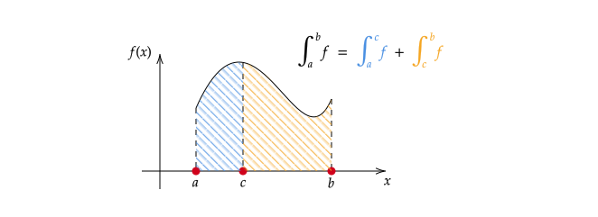

<!-- This is needed since I am working with svg files from mathcha.io. It converts the graphics files to something that can be used in the pdf files. Code taken from https://stackoverflow.com/questions/50165404/how-to-make-a-pdf-using-bookdown-including-svg-images/56044642#56044642 -->

\newpage
\pagenumbering{arabic}

# Introduction {-}
Here is the material to accompany Week 11 of the Analysis 1B course. Alternative formats can be downloaded by clicking the download icon at the top of the page. Please send any comments or corrections to [Christian Jones (caj50)](mailto:caj50@bath.ac.uk). To return to the homepage, click [here](http://caj50.github.io/tutoring.html).

<!--

Want to ruin the surprise?

 
Well, you asked for it!

-->

# Lecture Recap
There's no tutorial this week due to the May Day bank holiday. However, there's still a bit of the course to summarise (including the fundamental theorem of calculus). So here, you'll find some material that would have been covered if everything was running as normal.

## Some Integral Theorems
We begin with two theorems, which basically say that integrals behave as you'd expect them to.

\BeginKnitrBlock{theorem}BEGINSORTNAMEOUTMARKER-ENDSORTNAMEOUTMARKER
<strong>(\#thm:thm1)  (Additivity of the Integral) </strong>
Let $a<b$ and let $f:[a,b] \to \mathbb{R}$ be bounded. For any $c \in (a,b)$, $f$ is integrable on $[a,b]$ if and only if $f$ is integrable on $[a,c]$ and $[c,b].$ In this case $$\int_a^b f = \int_a^c f + \int_c^b f.$$

\EndKnitrBlock{theorem}
We can see this theorem in action below in Figure \@ref(fig:additivity).

(\#fig:additivity)The integral being additive means that to integrate a function $f$ on a domain $[a,b]$, we can just sum up the integrals of $f$ on some smaller domains. This is especially useful for functions defined piecewise.

\BeginKnitrBlock{theorem}BEGINSORTNAMEOUTMARKER-ENDSORTNAMEOUTMARKER
<strong>(\#thm:thm2)  (Linearity of the Integral) </strong>
Let $a<b$, $\lambda \in \mathbb{R}$ and let $f,g:[a,b] \to \mathbb{R}$ be integrable. Then

1) $f+g$ is integrable, with $$\int_a^b f+g = \int_a^b f + \int_a^b g,$$
2) $\lambda f$ is integrable, with $$\int_a^b \lambda f = \lambda \int_a^b f.$$

\EndKnitrBlock{theorem}
Now is the time to bring some algebra into the mix. Since the zero function $0:[a,b] \to \mathbb{R}$ given by $0(x) = 0$ is integrable, this means that the set of integrable functions on $[a,b]$ is a vector subspace of the set of bounded functions on $[a,b]$.

### Useful Results about $\sup$ and $\inf$.
To prove the above two theorems, we need to know a bit about how the bounds of a sum of two bounded functions behave. The following results tell us exactly what we want!

\BeginKnitrBlock{proposition}BEGINSORTNAMEOUTMARKER-ENDSORTNAMEOUTMARKER
<strong>(\#prp:prop1) </strong>
For $I \subseteq \mathbb{R}$ non-empty, $\lambda \in \mathbb{R}$ and $f,g:I \to \mathbb{R}$ bounded. Then:
  
  * $f+g$ is bounded, with $$\sup_{I}(f + g) \leq \sup_{I}f + \sup_{I}g, \quad \inf_{I}(f + g) \geq \inf_{I}f + \inf_{I}g$$
  * If $\lambda \geq 0$: $$\sup_{I}(\lambda f) = \lambda\sup_{I}f, \;\; \inf_{I}(\lambda f) = \lambda\inf_{I}f,$$
  * If $\lambda < 0$: $$\sup_{I}(\lambda f) = \lambda\inf_{I}f, \;\; \inf_{I}(\lambda f) = \lambda\sup_{I}f,$$

\EndKnitrBlock{proposition}

### Some Other Useful Facts
Using everything we've learned so far, we can state a few more facts about integrals!

\BeginKnitrBlock{proposition}BEGINSORTNAMEOUTMARKER-ENDSORTNAMEOUTMARKER
<strong>(\#prp:prop2) </strong>
If $a<b$ and $f,g:[a,b] \to \mathbb{R}$ are integrable, then:
  
  1) $\int_a^a f = 0$ (This is by definition!)
  2) $\int_b^a f := -\int_a^b f$ (This is also by definition!) 
  3) The function $f \cdot g$ is integrable (recall $(f\cdot g)(x) = f(x)g(x)$)
  4) $\lvert f \rvert$ is integrable, with $$\left\lvert\int_a^b f \right\rvert \leq \int_a^b \lvert f \rvert.$$

\EndKnitrBlock{proposition}
It's worth mentioning here that point 4 above is actually an analogue of the triangle inequality for integrals!

## The Fundamental Theorem(s) of Calculus
We've finally made it to the biggest theorems of the course, and this ties in everything done in the last 11 weeks! Despite usually being called *the* fundamental theorem of calculus (FTC), it actually encompasses two statements, which is why we state them separately below:

\BeginKnitrBlock{theorem}BEGINSORTNAMEOUTMARKER-ENDSORTNAMEOUTMARKER
<strong>(\#thm:thm3)  (Fundamental Theorem of Calculus I) </strong>
Let $a<b$ and $I \subseteq \mathbb{R}$ be an open interval containing $[a,b]$. Let $F:I \to \mathbb{R}$ be differentiable on $I$, and let $f:[a,b] \to \mathbb{R}$ be such that

   * $f(x) = F'(x) \;\; \forall x \in [a,b]$,[^1]
   * $f$ is integrable on $[a,b]$.
   
Then $$\int_a^b f  = F(b) - F(a).$$

\EndKnitrBlock{theorem}

\BeginKnitrBlock{theorem}BEGINSORTNAMEOUTMARKER-ENDSORTNAMEOUTMARKER
<strong>(\#thm:thm4)  (Fundamental Theorem of Calculus II) </strong>
Let $f:[a,b] \to \mathbb{R}$ be integrable, and define $F;[a,b] \to \mathbb{R}$ via $$F(x) = \int_a^x f.$$ Then

  * $F$ is continuous on $[a,b],$ and
  * If $f$ is continuous at $c \in (a,b)$, then $F$ is differentiable at $c \in (a,b)$ with $F'(c) = f(c).$
   
   

\EndKnitrBlock{theorem}

So, why should we like these theorems so much? The first theorem makes finding integrals much easier, as derivatives are (generally) nicer to deal with than Riemann sums! The second theorem here gives you *existence* of a primitive for $f$, which you can apply the first theorem to!

As a warning, if in Theorem \@ref(thm:thm4) $f$ is **not** continuous at $c \in (a,b)$, $F$ may still be differentiable at $c$! See Problem Sheet 11, Tutorial Question 1 for more details.

[^1]: This is the definition of $F$ being a *primitive* for $f$.

## Integration Techniques
To finish the lecture recap, it would be handy to have some theorems which back up some standard integration techniques. Turns out that we do! The first of these (in a fashion) 'undoes' the differential product rule.

\BeginKnitrBlock{theorem}BEGINSORTNAMEOUTMARKER-ENDSORTNAMEOUTMARKER
<strong>(\#thm:thm5)  (Integration By Parts) </strong>
Let $f,g:[a,b] \to \mathbb{R}$ be continuous. Suppose that $F,G:[a,b] \to \mathbb{R}$ are continuous on $[a,b]$ and differentiable on $(a,b)$ with $F'(x) = f(x)$ and $G'(x) = g(x)\;\; \forall x \in (a,b).$ Then $$\int_a^b fG = F(b)G(b) - F(a)G(a) - \int_a^b Fg.$$
      

\EndKnitrBlock{theorem}

And finally, the second of these can be seen as a way of 'undoing' the differential chain rule.

\BeginKnitrBlock{theorem}BEGINSORTNAMEOUTMARKER-ENDSORTNAMEOUTMARKER
<strong>(\#thm:thm6)  (Integration By Substitution) </strong>
Let $I \subseteq \mathbb{R}$ be a closed interval and let $f:I \to \mathbb{R}$ be continuous on $I$. Also, let $J \subseteq \mathbb{R}$ be an open interval, and let $u: J \to I$ be continuously differentiable[^2]. Then, for $a,b \in J$, $$\int_a^b (f \circ u) u' = \int_{u(a)}^{u(b)} f.$$
      

\EndKnitrBlock{theorem}

[^2]: This means that $u$ is differentiable on $J$, and that the derivative $u'$ is continuous on $J$. For interest, the set of all continuously differentiable functions from a set $J$ is denoted by $C^{1}(J)$.
 

<!--chapter:end:index.Rmd-->

