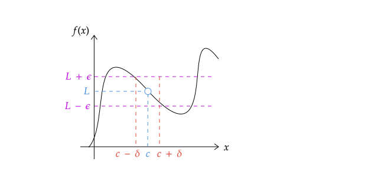

<!-- This is needed since I am working with svg files from mathcha.io. It converts the graphics files to something that can be used in the pdf files. Code taken from https://stackoverflow.com/questions/50165404/how-to-make-a-pdf-using-bookdown-including-svg-images/56044642#56044642 -->

\newpage
\pagenumbering{arabic}

# Introduction {-}
Here is the material to accompany the 2nd Analysis 1B Tutorial on the 13th February. Alternative formats can be downloaded by clicking the download icon at the top of the page. Please send any comments or corrections to [Christian Jones (caj50)](mailto:caj50@bath.ac.uk). To return to the homepage, click [here](http://caj50.github.io/tutoring.html).

# Lecture Recap
The course has finally begun proper! For the next few weeks, we're going to see the first section: limits and continuity of functions. Despite another complicated definition to work with, it will turn out that many of the concepts can be made eerily similar to stuff you saw from Semester 1.

## Definition of a Limit

### Functions
To begin, we pick up where Analysis 1A left off, and start talking about functions.
\BeginKnitrBlock{definition}BEGINSORTNAMEOUTMARKER-ENDSORTNAMEOUTMARKER
<strong>(\#def:def1)  (Function) </strong>
Let $A$ and $B$ be sets. A function from $A$ to $B$ is a rule that assigns to each element of $A$ a unique element of $B$. The set $A$ is called the domain of the function, and $B$ is called the codomain of the function.

\EndKnitrBlock{definition}
So, to specify a function, we need a domain, codomain and a rule that tells us how to get between the two. We can write a function $f$ symbolically as follows:
\begin{align*}
f:\; &A \longrightarrow B,\\
&x \longmapsto f(x).
\end{align*}

A specific type of domain we are going to need in the near future is that of a *punctured neighbourhood*.
\BeginKnitrBlock{definition}BEGINSORTNAMEOUTMARKER-ENDSORTNAMEOUTMARKER
<strong>(\#def:def2)  (Punctured Neighbourhood) </strong>
Let $c\in\mathbb{R}$, and $D \subseteq \mathbb{R}$. Then $D$ is a punctured neighbourhood of $c$ if there exists a $\delta_0$ such that the set $(c-\delta_0,c)\cup(c,c + \delta_0) \subseteq D.$

\EndKnitrBlock{definition}
For example, if we take $c = 0$, potential punctured neighbourhoods include:

* $D = (-2,2)$ (This works with any $0 < \delta_0 < 2$)
* $D = (-3,5)\setminus\lbrace0,1\rbrace$ (This works with any $0 < \delta_0 < 1$)
* $D = \mathbb{R}$ (This works with *any* positive $\delta_0$)

### The Definition
One thing we may be interested in for a function is what happens as we approach a particular value from inside the domain. More specifically, we are interested in what happens to the corresponding codomain values: do they approach something finite, oscillate wildly, or behave even more bizarrely? In the first case, we can talk about a limiting value, of which the precise definition is formulated below:
\BeginKnitrBlock{definition}BEGINSORTNAMEOUTMARKER-ENDSORTNAMEOUTMARKER
<strong>(\#def:def3)  (Limit of a Function) </strong>
Let $c, L\in\mathbb{R}$, and let $f: D \longrightarrow \mathbb{R}$ be a function defined on a punctured neighbourhood of $c$. Then $\lim_{x \to c} f(x) = L$ means $$\forall \epsilon > 0 \;\; \exists \delta > 0\;\; \text{s.t.} \;\; \forall x \in D, \;\; 0 < \lvert x - c \rvert < \delta \;\Rightarrow\; \lvert f(x) - L \rvert < \epsilon.$$

\EndKnitrBlock{definition}
Alternatively, we can say that $f(x) \to L$ as $x \to c$ if this definition is satisfied. Loosely, this says that "however close you want the function to be to $L$ at $x = c$, you can always find a range of $x$ values that make this possible." Graphically, we may be in a situation as in Figure \@ref(fig:funclim).

(\#fig:funclim)A diagram showing the limiting process for functions. For the given $\epsilon$ in the diagram, we see that whenever we are within a distance $\delta$ of $c$ in the domain, evaluating the function leaves us within a distance $\epsilon$ of $L$. Note that the function isn't defined at $c$, but the limiting value $L$ still exists.

Once we have a definition, it makes sense to also consider its negation. Namely, we have that $f(x)$ does not approach[^1] $L$ as $x \to c$ when $$\exists \epsilon_0 > 0\;\;\text{s.t}\;\;\forall \delta > 0,\;\; \exists x_0 \in D \;\; \text{s.t.}\;\; 0 < \lvert x_0 - c \rvert < \delta\;\; \text{and}\;\; \lvert f(x_0) - L \rvert \geq \epsilon_0.$$

### Using the Definition in Practice
In the exam, it is **highly** likely that you'll be made to use this definition to calculate a limit. In doing so, you'll need to bound a function that is wrapped up in an absolute value. There are two results from Semester 1 that can help with this, and if you haven't already, make sure that you commit these results to memory.
\BeginKnitrBlock{theorem}BEGINSORTNAMEOUTMARKER-ENDSORTNAMEOUTMARKER
<strong>(\#thm:thm46)  (Triangle Inequalities) </strong>
For $x,y \in \mathbb{R}$:
  
  *  $\lvert x + y \rvert \leq \lvert x \rvert + \lvert y \rvert.$
  *  $\left\lvert \lvert x \rvert - \lvert y \rvert \right\rvert \leq \lvert x - y \rvert.$
  

\EndKnitrBlock{theorem}
The second result here --- the *reverse triangle inequality* --- will be incredibly useful when we need to bound fractions.

[^1]: This can also be written $f(x) \not\to L$.

## Two Useful Results
One thing we would definitely like to know is that if a limit of a function exists, is it unique? Luckily, the answer to this is yes, and is summed up in the following result:
\BeginKnitrBlock{proposition}BEGINSORTNAMEOUTMARKER-ENDSORTNAMEOUTMARKER
<strong>(\#prp:prop1)  (Uniqueness of Limits) </strong>
Let $c\in\mathbb{R}$ and let $f:D \to \mathbb{R}$ be a function defined on a punctured neighbourhood $D$ of $c$. If $\exists L, M \in \mathbb{R}$ such that $\lim_{x\to c} f(x) = L$ and $\lim_{x\to c} f(x) = M$, then $L=M$.

\EndKnitrBlock{proposition}

Another useful result regarding functions we can state here is known as the *inertia principle*:
\BeginKnitrBlock{proposition}BEGINSORTNAMEOUTMARKER-ENDSORTNAMEOUTMARKER
<strong>(\#prp:prop2)  (Inertia) </strong>
Let $c\in\mathbb{R}$ and let $f:D \to \mathbb{R}$ be a function defined on a punctured neighbourhood $D$ of $c$. If $\lim_{x\to c} f(x) = L$, then for any $M < L$, there exists $\delta > 0$ such that $$\forall x \in D,\;\; 0 < \lvert x - c \rvert < \delta \; \Rightarrow \;\; f(x) > M.$$

\EndKnitrBlock{proposition}
This idea is summed up in Figure \@ref(fig:inertia) below. This principle is especially useful when the limit of a function at a point $c$ is positive, as it says that there is a punctured neighbourhood around $c$ in which the function remains positive.

(\#fig:inertia)A diagram showing the inertia principle in action. This principle says that if a function approaches a limit at a point, there is always an interval in which the function stays within a specified distance of the limit

## Sequential Characterisation of Limits
Using an $\epsilon$-$\delta$ definition of the limit is not the only way we can define the limit of a function! In fact, you've already seen something similar when dealing with sequential continuity last semester.

\BeginKnitrBlock{theorem}BEGINSORTNAMEOUTMARKER-ENDSORTNAMEOUTMARKER
<strong>(\#thm:thm1)  (Sequential Characterisation of Limit) </strong>
Let $c\in\mathbb{R}$ and let $f: D \to \mathbb{R}$, with $D$ a punctured neighbourhood of $c$. Then the following are equivalent[^2]:
  
* $\lim_{x\to c}f(x) = L,$
  
* For any sequence $(x_n)_n$ in $D\setminus\lbrace c \rbrace$ which converges to $c$, $$\lim_{n\to\infty}f(x_n) =L.$$
  

\EndKnitrBlock{theorem}

Why should you be pleased about this theorem? This allows you to apply all your Semester 1 knowledge of sequences to functions (for example, the algebra of limits)! In particular, if you can find two sequences $(x_n)_n$ and $(y_n)_n$ in $D\setminus\lbrace c\rbrace$ converging to $c$, but the sequences $\left(f(x_n)\right)_n$ and $\left(f(y_n)\right)_n$ approach different limits, this gives you an easy way of proving that function limits do not exist.

[^2]: You may see this abbreviated to 'TFAE' in some contexts.

# Hints
As per usual, here's where you'll find the problem sheet hints!

1) This one is mostly similar to the examples seen in lectures and the one we did in the tutorial. You might have to make a choice of delta near the start of your argument though, just so that $\lvert f(x) - L \rvert$ is well defined.
2) Choose a specific $\epsilon$ dependent on $L$ in the definition of limit. Then you should be able to rearrange and find the required $c_1$, $c_2$ and $\delta$.
3) Again, this is fairly similar to the ones we did in tutorials. Some Semester 1 material may also help here!
 

<!--chapter:end:index.Rmd-->

