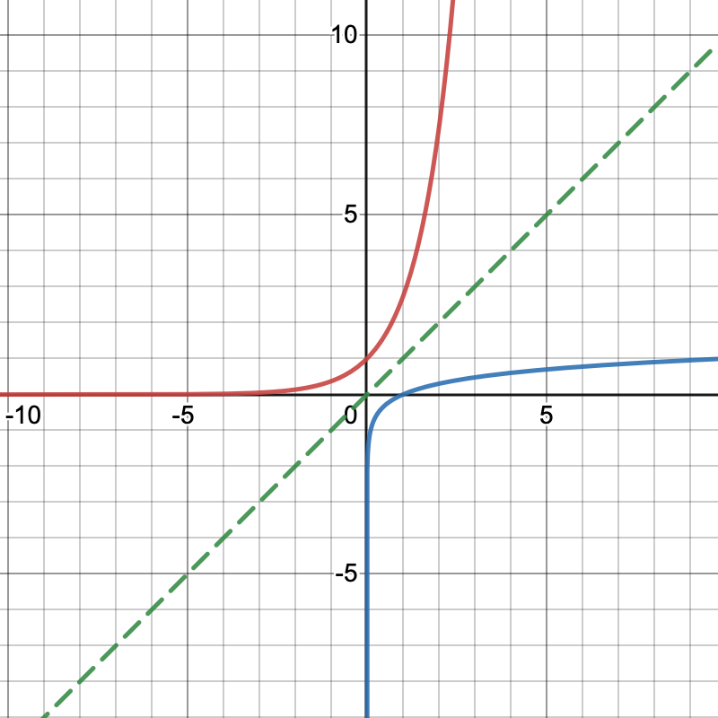

<!-- This is needed since I am working with svg files from mathcha.io. It converts the graphics files to something that can be used in the pdf files. Code taken from https://stackoverflow.com/questions/50165404/how-to-make-a-pdf-using-bookdown-including-svg-images/56044642#56044642 -->

\newpage
\pagenumbering{arabic}

# Introduction {-}
Here is the material to accompany the 5th Analysis 1B Tutorial on the 6th March. Alternative formats can be downloaded by clicking the download icon at the top of the page. Please send any comments or corrections to [Christian Jones (caj50)](mailto:caj50@bath.ac.uk). To return to the homepage, click [here](http://caj50.github.io/tutoring.html).

<!--

Want to ruin the surprise?

 
Well, you asked for it!

-->

# Lecture Recap
After what was mainly revision last week, we're moving onto some new stuff again! It turns out there's still a bit we can say about continuity, especially on compact intervals.

## Inverse Functions
A particularly useful class of functions we may be interested in are known as invertible. These functions $f: A \to B$ provide a way of moving between sets $A$ and $B$ (and back again) without losing any information about $A$ and $B$. Before we talk about them in more detail, it's worth recalling some definitions:

\BeginKnitrBlock{definition}
<strong>Definition 1.1   (Injectivity, Surjectivity and Bijectivity) </strong>
Let $f: A \to B$ be a function.

*  If $\forall x, y \in B$ with $x \neq y$, $f(x) = f(y) \implies x = y$, then $f$ is said to be injective.
* If $\forall y \in B$, $\exists x \in A$ such that $f(x) = y$, then $f$ is surjective.
* If $f$ is both injective and surjective, then it is called bijective.

\EndKnitrBlock{definition}
In words, bijectivity means that for a function $f:A \to B$, every element in the codomain $B$ is mapped to by a unique element in the domain $A$. These bijective functions are said to be invertible, that is, there exists an inverse function $f^{-1}: B \to A$ such that $f^{-1} \circ f$ and $f \circ f^{-1}$ produce the identity maps on $A$ and $B$ respectively.

Now that we have these definitions, we can say something about the continuity of inverse functions:

\BeginKnitrBlock{theorem}
<strong>Theorem 1.1  </strong>
Let $I \subseteq \mathbb{R}$ be a non-empty[^1] interval, and let $f: I \to \mathbb{R}$ be continuous on $I$. Assume that $f$ is strictly increasing[^2] (or strictly decreasing) on $I$. Then:
  
*  $J:=f(I)$ is an interval,
*  $f : I \to J$ is bijective, and
*  $f^{-1}: J \to I$ is continuous on $J$.

\EndKnitrBlock{theorem}

You've seen an example of this theorem in action in the lectures. This is repeated below, as we're going to use it to prove a powerful result regarding sequences.

\BeginKnitrBlock{example}
<strong>Example 1.1  </strong>
Consider the exponential function $\exp:\mathbb{R} \to \mathbb{R}$ defined by $$\exp(x)  = \sum_{n = 0}^{\infty} \frac{x^n}{n!} = \mathrm{e}^x.$$ Firstly, note that $\mathbb{R}$ is a non-empty interval. Now, using some results from Semester 1, we know that

* $\exp$ is continuous and strictly increasing on $\mathbb{R}$, and
* $\exp(\mathbb{R}) = (0,\infty)$.

Therefore, $\exp$ satisfies the hypotheses of the above theorem, and so $\exp: \mathbb{R} \to (0, \infty)$ is a bijection, with continuous inverse. This inverse function is the well-known *natural logarithm* $\ln: (0,\infty) \to \mathbb{R},$ where $x = \ln(y) \iff y = \exp(x).$

We can plot the graphs of $y = \exp(x)$ (in red), and $y = \ln(x)$ (in blue) to visually see that Theorem <a href="#thm:thm1">1.1</a> works. Also note that to plot the graph of an inverse function, we only need to reflect the graph of the original function through the line $y=x$ (dashed green line).

{width="30%"}

\EndKnitrBlock{example}

Now that we have this example, we can easily calculate another large class of sequence limits:
\BeginKnitrBlock{proposition}
<strong>Proposition 1.2  </strong>
Let $(a_n)_n$ and $(b_n)_n$ be real sequences such that $\lim_{n\to\infty}a_n = a$ and $\lim_{n\to\infty}b_n = b$. If $a_n^{b_n} \in \mathbb{R}\;\; \forall n \in \mathbb{N}$, and $a>0$, then $$\lim_{n \to \infty} a_n^{b_n} = \left(\lim_{n\to\infty} a_n\right)^{\lim_{n\to\infty}b_n}.$$

\EndKnitrBlock{proposition}

**Proof**

\BeginKnitrBlock{proof}
<strong>Proof. </strong> 
Since $\lim_{n \to \infty}a_n = a > 0$, then $\exists N\in\mathbb{N}$ such that $\forall n \geq N$, $$\lvert a_n - a \rvert < \frac{a}{2} \Longleftrightarrow \frac{a}{2} < a_n < \frac{3a}{2}.$$ In particular, $a_n > 0$ for all $n \geq N$.

Now, for $n \geq N$,
$$\begin{align*}
a_n^{b_n} &= \exp\left(\ln\left(a_n^{b_n}\right)\right)\;\;\text{(as $a_n > 0$)},\\
&= \exp\left(b_n\ln\left(a_n\right)\right)\;\;\text{(properties of $\ln$)}.
\end{align*}$$
So as $n \to \infty$, we have that as both $\exp$ and $\ln$ are continuous (Example <a href="#exm:ex1">1.1</a>),
$$\begin{align*}
a_n^{b_n} &\to \exp\left(b\ln(a)\right)\\
&= \exp\left(\ln\left(a^b\right)\right),\\
&= a^b.
\end{align*}$$

&squ;

\EndKnitrBlock{proof}

[^1]: This is so we can talk about surjectivity.
[^2]: In other words, for all $x,y \in I$ with $x < y,$ $f(x) < f(y)$.

## Weierstrass Extremal Theorem
Much like the Intermediate Value Theorem, we can obtain some special continuity results when our functions are defined on compact (i.e. closed and bounded) intervals. One of the main results from this week is stated below:

\BeginKnitrBlock{theorem}
<strong>Theorem 1.3   (Weierstrass Extremal Theorem (WET)) </strong>
Let $a,b \in \mathbb{R}$ with $a<b$, and let[^3] $f \in C^{0}([a,b])$. Then:
  
  1. $f$ is bounded: $$\exists M > 0 \;\;\text{s.t.}\;\; \lvert f(x) \rvert \leq M\;\;\forall x \in [a,b].$$
  
  2. $f$ attains its bounds: $$\exists p,q \in [a,b] \;\; \text{s.t}\;\; \forall x \in [a,b], f(q) \leq f(x) \leq f(p).$$
  

\EndKnitrBlock{theorem}
This last point states that if $f \in C^{0}([a,b])$, $$\sup_{x \in [a,b]}f(x) = \max_{x\in[a,b]}f(x)\;\;\text{and}\;\;\inf_{x \in [a,b]}f(x) = \min_{x\in[a,b]}f(x).$$ So in fact, what this theorem tells us is that for a function defined on a compact interval, we have some control on its growth, and we know that the function has a maximum and minimum value! This can be seen pictorally in Figure <a href="#fig:wet">1.1</a>.

![Figure 1.1: This function $f$ is continuous on $[a,b]$, so by the Weierstrass Extremal Theorem, $f$ is bounded on $[a,b]$. Also, we see that there exist points $p$ and $q$ in the domain at which $f$ achieves its maximum and minimum values.](WET.svg)

[^3]: Recall that $C^{0}([a,b])$ is the set of continuous functions mapping from the set $[a,b]$.

# Hints
As per usual, here's where you'll find the problem sheet hints!

1) This one is largely similar to the one that was covered in tutorials — you just need to be a bit more careful when verifying the hypothesis of the theorem involving inverse functions. When proving bijectivity, you can use results from tutorial question 1 to help too!
2)  i) The question you're trying to answer here is does $\max_{[a,x]}f(x)$ exist?
    ii) For $x \leq y$, $[a,x] \subseteq [a,y]$.
    iii) This is a bit tricky[^5]. Consider the case $f(c) < g(c)$ first, and use inertia to show that $\exists \delta > 0$ such that $g(x) = g(c)$ on some interval. For the case $f(c) = g(c)$, recall that continuity of $f$ says that for any $\epsilon > 0$, there exists a $\delta > 0$ such that $$\lvert x - c \rvert < \delta \implies -\frac{\epsilon}{2} < f(x) - f(c) < \frac{\epsilon}{2}.$$ Using each side of this inequality in turn, the definition of $g$, and part ii), you need to show that for $\lvert x - c \rvert < \delta$, we have $$g(x) - g(c) > -\frac{\epsilon}{2}\;\;\;\text{and}\;\;\;g(x) \leq g(c) + \frac{\epsilon}{2}.$$ Combine these inequalities to then prove continuity of $g$.

[^5]: Alternatively, you could try and find left and right limits at the point $c$, using (some variations of) a result from Problem Sheet 3. Note that this way involves three main cases: $c = a$, $c = b$, or $c$ is in $(a,b)$. (There's also a fourth case when $a = b$ and $f$ is defined at a single point, but then $g$ is automatically continuous.)
 

<!--chapter:end:index.Rmd-->

