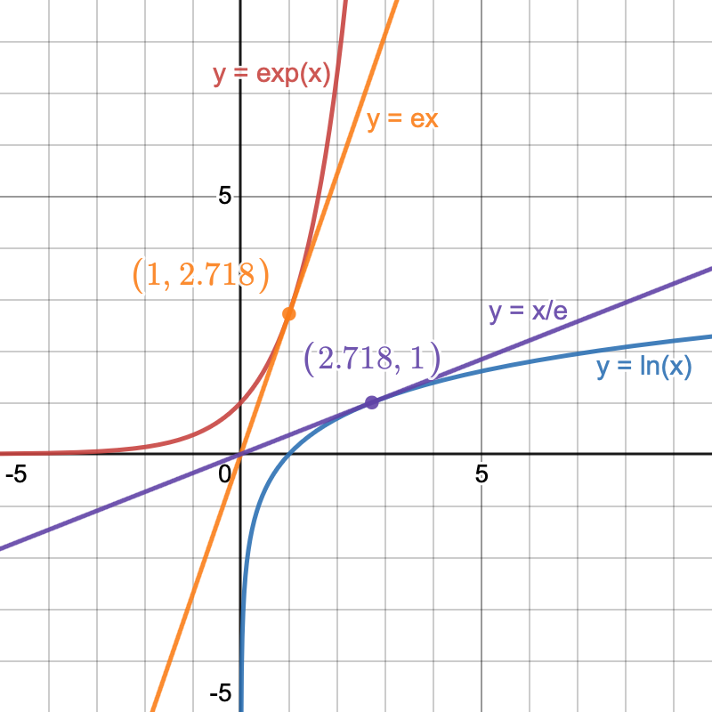

<!-- This is needed since I am working with svg files from mathcha.io. It converts the graphics files to something that can be used in the pdf files. Code taken from https://stackoverflow.com/questions/50165404/how-to-make-a-pdf-using-bookdown-including-svg-images/56044642#56044642 -->

\newpage
\pagenumbering{arabic}

# Introduction {-}
Here is the material to accompany the 7th Analysis 1B Tutorial on the 20th March. Alternative formats can be downloaded by clicking the download icon at the top of the page. Please send any comments or corrections to [Christian Jones (caj50)](mailto:caj50@bath.ac.uk). To return to the homepage, click [here](http://caj50.github.io/tutoring.html).

<!--

Want to ruin the surprise?

 
Well, you asked for it!

-->

# Lecture Recap
This week, we look at more results regarding differentiation! These cover finding the derivative of an inverse function, and locating the extrema of a differentiable function. Finally, we'll reach one of the more important results in this course --- the mean value theorem.

## Inverse Functions
One thing we might want to know is whether we can differentiate the inverse of a differentiable function. For example, the exponential function, $\exp$, and the trigonometric functions, $\sin, \cos$, etc. have nice series definitions, and this makes it fairly straightforward to calculate their derivatives. But what if we're interested in their inverses ($\ln, \arcsin, \arccos$)? Luckily, we have a theorem which tells us what the values of their derivatives are!

\BeginKnitrBlock{theorem}
<strong>Theorem 1.1   (Inverse Function Theorem) </strong>
Let $f: (a,b) \to (A, B)$ be bijective, and let $c \in (a,b).$ Assume that $f$ is differentiable at $c$, $f'(c) \neq 0$, and $f^{-1}$ is continuous at $f(c).$ Then $f^{-1}$ is differentiable at $y_0 = f(c)$ and $$\left(f^{-1}\right)'(y_0) = \frac{1}{f'\left(f^{-1}(y_0)\right)} = \frac{1}{f'(c)}.$$
  

\EndKnitrBlock{theorem}

You've seen the below example in lectures, but its worth repeating here, as we're going to use it later:
\BeginKnitrBlock{example}
<strong>Example 1.1  </strong>
Returning to our exponential example from last week, we know that from lectures $\exp: \mathbb{R} \to (0,\infty)$ is differentiable for all $c \in \mathbb{R}$, and since $\exp'(x) = \exp(x)$, $\exp'(c) \neq 0$ for any $c$. Last week, we showed that the inverse function $\ln: (0,\infty) \to \mathbb{R}$ is continuous at any $\exp(c) \in (0,\infty)$, so by Theorem <a href="#thm:thm3">1.3</a>, $\ln$ is differentiable on $(0,\infty)$, with $$\ln'(y_0) = \frac{1}{\exp'(\ln(y_0))} = \frac{1}{\exp(\ln(y_0))} = \frac{1}{y_0}.$$ Graphically, we can see the result of this theorem by comparing the gradient of the associated tangent lines of $\exp$ and $\ln$ at the points $(c,\exp(c))$ and $(\exp(c),c)$ respectively. In the graph below, we have taken $c = 1$ for illustrative purposes.

{width="30%"}

\EndKnitrBlock{example}

We can use the results of Example <a href="#exm:ex1">1.1</a> and the rules of differentiation from last week to calculate the derivatives of some more complicated functions:
\BeginKnitrBlock{example}
<strong>Example 1.2  </strong>
Consider the function $h:(0,\infty) \to (0,\infty)$ given by $h(x) = x^x.$ Since $$h(x) = \exp(\ln(x^x)) = \exp(x\ln(x)),$$ we can rewrite $h$ as a composition of differentiable functions $h = f \circ g$, where $f:\mathbb{R} \to (0,\infty)$ is defined by $f(x) = \exp(x)$, and $g: (0,\infty) \to \mathbb{R}$ is defined by $g(x) = x\ln(x).$
  
From lectures, we know that $f$ is differentiable on $\mathbb{R}$ with $f'(x) = \exp(x).$ Furthermore, by Example <a href="#exm:ex1">1.1</a> and the product rule, we know that $g$ is differentiable on $(0,\infty)$, with $g'(x) = \ln(x) + 1.$ Hence, by the chain rule, $h$ is differentiable on $(0,\infty)$ with $$h'(x) = f'(g(x))g'(x) = \exp(x\ln(x))\left(\ln(x) + 1\right) = x^x\left(\ln(x) + 1\right)$$

\EndKnitrBlock{example}
Theorem <a href="#thm:thm1">1.1</a> will come in handy if you ever need to perform coordinate transforms, in particular when evaluating integrals by substitution. You may have also come across the multivariate version of this theorem in MA10230 (Multivariable Calculus and Differential Equations) when calculating the Jacobian for a transformation from Cartesian to polar coordinates (or vice versa).

## Extrema
Recall the Weierstrass Extremal Theorem: If a function is continuous on a closed, bounded interval, then it attains a maximum and minimum value. However, note that this tells us nothing about how many times it reaches these values, and tells us nothing about where the max and min are attained. From a physics point of view, this is something we'd really like to know, as it would help us determine when a projectile reaches its maximum height, for example.

However, to get started here, we need a slew of definitions.

\BeginKnitrBlock{definition}
<strong>Definition 1.1   (Absolute/Global Extrema) </strong>
Let $I\subseteq \mathbb{R}$ be an interval, $p,q\in I$ and $f:I\to\mathbb{R}$.

*  The point $p$ is an *absolute* or *global maximum point* of $f$ in $I$ if $$\forall x \in I,\;\;f(x) \leq f(p).$$
*  Similarly, $q$ is an *absolute* or *global minimum point* of $f$ in $I$ if $$\forall x \in I,\;\;f(x) \geq f(q).$$
  
An *extremum* of $f$ is either a maximum point or a minimum point.

\EndKnitrBlock{definition}

We might also be interested in restricting our function to a smaller interval and seeing what the new maxima/minima are. This gives rise to the idea of *local* extrema:

\BeginKnitrBlock{definition}
<strong>Definition 1.2   (Local Extrema) </strong>
Let $I\subseteq \mathbb{R}$ be an interval, $p,q\in I$ and $f:I\to\mathbb{R}$.

* The point $p$ is a *local maximum point* of $f$ in $I$ if $\exists \delta_0 > 0$ such that $$\lvert x - p \rvert < \delta_0 \implies f(x) \leq f(p).$$
* The point $q$ is a *local minimum point* of $f$ in $I$ if $\exists \delta_0 > 0$ such that $$\lvert x - q \rvert < \delta_0 \implies f(x) \geq f(q).$$
  
A *local extremum* of $f$ is either a local maximum or local minimum point.

\EndKnitrBlock{definition}

One final concept we will need occurs when our function is differentiable, and is known as a critical point:

\BeginKnitrBlock{definition}
<strong>Definition 1.3   (Critical Point) </strong>
Let $I\subseteq \mathbb{R}$ be an interval, $c\in I$ and $f:I\to\mathbb{R}$. Then $c$ is a *critical* or *turning point* of $f$ if $f$ is differentiable at $c$ and $f'(c) = 0.$

\EndKnitrBlock{definition}

Hopefully this terminology isn't too confusing. As an example, we can sketch a graph (Figure <a href="#fig:Extrema">1.1</a>), and identify the global and local extrema, together with the critical points:

![Figure 1.1: A graph of a function $f:[a,b] \to \mathbb{R}$ with the global extrema (blue), local extrema (red), and critical points (black) identified. Note that these points lie in the domain of $f$, and that some points fit into more than one category.](Extrema.svg)

An important point we still need to make here is how we actually go about finding these extrema. What we find is that the **candidate extrema are critical points, and interval endpoints**! So all we have to do is locate these points, and evaluate our function there.

## The Mean Value Theorem (MVT)
In this section, we hit the third big theorem of the course: the Mean Value Theorem. It looks fairly innocuous, but it turns out we can do a lot with this (and its variants). For example, we can prove a powerful method for calculating limits (L'Hôpital's rule), we can use it to approximate functions (Taylor's theorem), and we can even use it to prove the fundamental theorem of calculus![^1]

\BeginKnitrBlock{theorem}
<strong>Theorem 1.2   (Mean Value Theorem (MVT)) </strong>
Let $a<b$, and let $f:[a,b] \to \mathbb{R}$ be continuous on $[a,b]$ and differentiable on $(a,b)$. Then, $\exists c \in (a,b)$ such that $$f'(c) = \frac{f(b) - f(a)}{b - a}.$$

\EndKnitrBlock{theorem}
Note that this theorem guarantees the existence of **at least** one point $c$ --- Figure <a href="#fig:MVT">1.2</a> shows that there may be more than one! The proof of the MVT relies on what is known as *Rolle's Theorem*, of which the statement can be given by setting $f(a) = f(b)$ in Theorem <a href="#thm:thm2">1.2</a>. 

It's worth noting that there is a more general mean value theorem, which is yet another result named after Cauchy[^2]:

\BeginKnitrBlock{theorem}
<strong>Theorem 1.3   (Cauchy Mean Value Theorem (CMVT)) </strong>
Let $a<b$ and let $f,g:[a,b] \to \mathbb{R}$ be continuous on $[a,b]$ and differentiable on $(a,b)$. Then, $\exists c \in (a,b)$ such that $$(f(b) - f(a))g'(c) = (g(b)-g(a))f'(c).$$

\EndKnitrBlock{theorem}
This one is a bit harder to visualise conceptually, but we can do it! Suppose we parametrise a curve $C$ as $\mathbf{r}:[a,b] \to \mathbb{R}^2$ via $\mathbf{r}(t) = (f(t),g(t))$ (so that $x = f(t)$ and $y = g(t)$). Then the CMVT says that there must be a point $c \in (a,b)$ where the gradient of the tangent to $(f(c),g(c))$ is the same as the gradient of the line joining the points $(f(a),g(a))$ and $(f(b), g(b))$. This is shown in Figure <a href="#fig:CMVT">1.3</a>.

[^1]: In fact, the MVT also explains why average speed cameras work. These cameras come in pairs on a road, and register when you pass each of them. If the distance between the cameras divided by the time taken to move between them is greater than the speed limit on the road, then the MVT says that at some point in the journey, you must have travelled faster than the speed limit, and you'll get fined. This analysis does rely on assuming your motion is differentiable, i.e. you don't crash.

[^2]: Counting last semester, this brings us to the 5th result named after Cauchy!

# Hints
As per usual, here's where you'll find the problem sheet hints!

1) Remember that $\lvert x - 1\rvert$ is not differentiable at $x = 1$. So I would suggest splitting the domain up first to account for this. After doing this, there's an example in the lecture notes that may come in useful.
2) Try adapting the solutions to 'Problem Sheet 6, Tutorial Q1'.
3) Some of the ideas used in `Problem Sheet 7, Tutorial Q1' will be helpful here. Just remember to make sure that the hypotheses are satisfied when applying the Mean Value Theorem!

 

<!--chapter:end:index.Rmd-->

