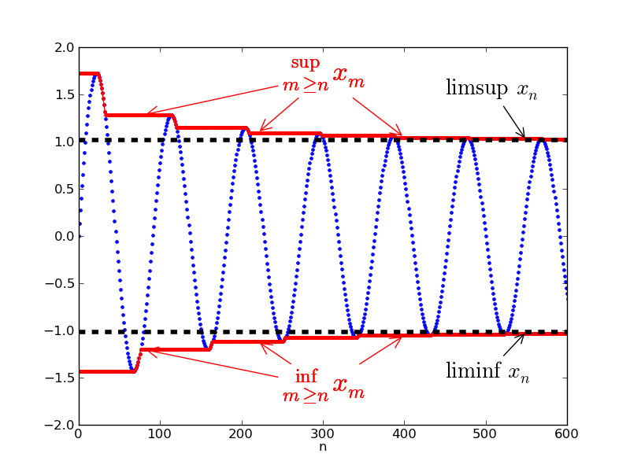

\newpage
\pagenumbering{arabic}

# Introduction {-}
Here is the material to accompany the analysis tutorial in Week 8. As usual, send comments and corrections to [Christian Jones (caj50)](mailto:caj50@bath.ac.uk). To return to the homepage, click [here](http://caj50.github.io/tutoring.html).

# Lecture Recap

## Limit Superior and Limit Inferior
It is not always the case that the limit of a sequence exists — take $(a_n)_{n\in\mathbb{N}}$ defined by $a_n = (-1)^n$, for example. But if a sequence $(a_n)_{n\in\mathbb{N}}$ is bounded, there are two objects that always exist. These are the *limit superior* and *limit inferior* of a sequence. To start define these, we first let $(a_n)$ be a real sequence, and for each $k \in \mathbb{N}$, define $$A_k = \lbrace a_n \,\lvert\, n \geq k\rbrace = \lbrace a_k,\,a_{k+1}\,\ldots\rbrace$$

We also use some different notation to describe the supremum and infimum of the sets $A_k$, namely [^1] $$\sup A_k := \sup_{n\geq k}a_n \quad ; \quad \inf A_k := \inf_{n \geq k}a_n.$$ One thing we can say about these quantities is that since $A_{k+1} \subseteq A_k$, we know that $(\sup A_k)_{k\in\mathbb{N}}$ is a decreasing sequence, and $(\inf A_k)_{k\in\mathbb{N}}$ is an increasing sequence. Now that we've produced two new sequences, the natural thing to do is analyse their convergence. It turns out that if $(a_n)_{n\in\mathbb{N}}$ is bounded, both $(\sup A_k)_{k\in\mathbb{N}}$ and $(\inf A_k)_{k\in\mathbb{N}}$ converge! We define their respective limits to be [^2] $$\limsup_{n \to \infty} a_n := \lim_{k\to\infty}\sup_{n\geq k}a_n \;\, \text{and} \;\, \liminf_{n \to \infty} a_n := \lim_{k\to\infty}\inf_{n\geq k}a_n.$$ The first of these is the *limit superior* and the second is the *limit inferior*. These can be thought of as `eventual' bounds on a sequence, as seen in Figure \@ref(fig:limsup) (Taken from [Wikipedia](https://en.wikipedia.org/wiki/Limit_inferior_and_limit_superior)).


{width="50%"}


There is also another way of interpreting the limits superior and inferior. For a sequence $(a_n)_{n\in\mathbb{N}}$, we can also think of $\limsup_{n\to\infty} a_n$ and $\liminf_{n \to \infty}a_n$ as being the largest and smallest possible limits of any subsequence of $(a_n)_{n\in\mathbb{N}}$. We can use this to characterise convergent sequences!

```{theorem label = "thm1"}
A sequence $(a_n)_{n\in\mathbb{N}}$ is convergent if and only if $$\limsup_{n \to \infty} a_n = \liminf_{n \to \infty} a_n.$$
```
To end this section, we state two more results. They're not mentioned in the lecture notes, but they can be incredibly useful when performing calculations[^3].

```{theorem label = "thm2"}
Let $(a_n)_{n\in\mathbb{N}}$ and $(b_n)_{n\in\mathbb{N}}$ be real sequences. Then: $$\limsup_{n\to\infty}(a_n + b_n) \leq \limsup_{n\to\infty}a_n +\limsup_{n\to\infty}b_n,$$ and $$\liminf_{n\to\infty}(a_n + b_n) \geq \liminf_{n\to\infty}a_n +\liminf_{n\to\infty}b_n.$$
```

[^1]:The notation here follows that used in the lecture notes rather than that used in lectures, as this is more common usage. Also, for convenience, if the set $A_k$ is not bounded above/below, we set the supremum/infimum to be $\infty$/$-\infty$.

[^2]:Again, if $(\sup A_k)_{k\in\mathbb{N}}$ diverges to $\infty$, $\limsup_{n \to \infty} a_n$ is defined to be $\infty$, and if $(\inf A_k)_{k\in\mathbb{N}}$ diverges to $-\infty$, $\liminf_{n \to \infty} a_n$ is defined to be $-\infty$.

[^3]:Since these results are not in the lecture notes, it's *highly* recommended that you try and prove them yourself. Try using similar techniques to Tutorial Question 2 on Problem Sheet 7 and Homework Question 2 on Problem Sheet 3.

## Series
It might look like we're done with sequences, but in the grand scheme of things, we're only really getting started. Since with each sequence $(a_n)_{n\in\mathbb{N}}$, we have an infinite list of real numbers, we might consider trying to manipulate them in some way. One way we can do this is by adding them together, which leads to the notion of a *series*.

```{definition, label = "def1", name = "Series"}
Let $(a_n)_{n \in \mathbb{N}}$ be a real sequence. Then $$\sum_{n = 1}^{\infty} a_n$$ is called a series for $(a_n)_{n\in\mathbb{N}}$.
```

Much like with sequences, we have an analogous version of convergence for a series:
```{definition, label = "def2", name = "Series Convergence and Partial Sums"}
Let $(a_n)_{n \in \mathbb{N}}$ be a real sequence. Then $\sum_{n = 1}^{\infty} a_n$ converges if and only if the sequence $(S_N)_{N \in \mathbb{N}}$ converges, where $$S_N:= \sum_{n = 1}^{N} a_n$$ is the $N$\textsuperscript{th} partial sum. If $S_N \to \ell$ as $N \to \infty$, we define $$\ell = \sum_{n = 1}^{\infty}a_n.$$
```
If $(S_N)_{N\in\mathbb{N}}$ diverges to $\pm\infty$, we say that the corresponding series $$\sum_{n=1}^{\infty} a_n = \pm\infty.$$ Finally, if $(S_N)_{N\in\mathbb{N}}$ doesn't converge to a limit, we say that the series diverges without limit.

### Algebra of Series
By applying the algebra of limits to the sequences of partial sums, we can deduce some handy results.

```{theorem, label = "thm3", name = "Algebra of Series"}
Let $\sum_{n=1}^{\infty} a_n$ and $\sum_{n=1}^{\infty} b_n$ be convergent series, and let $\alpha,\beta \in \mathbb{R}$. Then $$\sum_{n = 1}^{\infty} (\alpha a_n + \beta b_n) = \alpha\sum_{n=1}^{\infty} a_n + \beta\sum_{n=1}^{\infty} b_n.$$
```

### Some Other Useful Results
Firstly, we can relate the size of the terms of a series to the overall sum.

```{proposition, label = "prop1"}
Let $\sum_{n=1}^{\infty} a_n$ and $\sum_{n=1}^{\infty} b_n$ be real series. If $a_n \leq b_n \, \forall n\in\mathbb{N}$, then $$\sum_{n=1}^{\infty} a_n \leq \sum_{n=1}^{\infty} b_n.$$
```

Secondly, we have a *necessary* condition for convergence of a series.

```{proposition, label = "prop2"}
Let $\sum_{n=1}^{\infty} a_n$ be a convergent series. Then $a_n \to 0$ as $n \to \infty$.
```
Note that the converse of this theorem *does not* hold (think of the sum $\sum_{n=1}^{\infty} \frac{1}{n}$). However, the contrapositive is very good at showing that a series does not converge!

```{proposition, label = "prop3"}
Let $\sum_{n=1}^{\infty} a_n$ be a series. If $a_n \not\to 0$ as $n \to \infty$, then $\sum_{n=1}^{\infty} a_n$ does not converge.
```

# Hints
As per usual, here's where you'll find the problem sheet hints!

1.  Try using a similar argument to the one used in tutorial question 1 (i.e. use the fact that the sequence can be split into odd and even cases to your advantage)
2.  For this question, think about what it means for a series to be convergent. You'll also want to split the terms of the series up in some way. (Think of tutorial question 3.)
3.  For the first part, think induction. The only other thing I'll say is to make sure you state all the main results you use!
4.  This is similar to homework question 2 and tutorial question 3.
5.  Ok, this one seems a bit evil, but you've seen something similar in the proof of Lemma 4.1 from the lecture notes. To start with, there are two cases: $$\limsup_{n\to\infty}\frac{a_{n+1}}{a_n} = \infty, \quad \text{and} \quad \limsup_{n\to\infty}\frac{a_{n+1}}{a_n}<\infty.$$ In the first case, there is nothing to prove (but you still need to tell me this in your answer!). For the second case, set $$\alpha = \limsup_{n\to\infty}\frac{a_{n+1}}{a_n}$$ and consider an arbitrary $\beta > \alpha.$ From this point, you need to do two things:

    *  Explain why there exists $N\in\mathbb{N}$ such that $$\frac{a_{n+1}}{a_n} \leq \beta \;\; \forall n \geq N.$$
    *  Prove that for all $n \geq N$, $$a_n \leq a_N\beta^{-N}\beta^n.$$
    
    Manipulate the result of this second bullet point, apply the results from Exercise Sheet 3, Tutorial Question 3 to conclude... and then go and grab a cup of tea or something.
    
